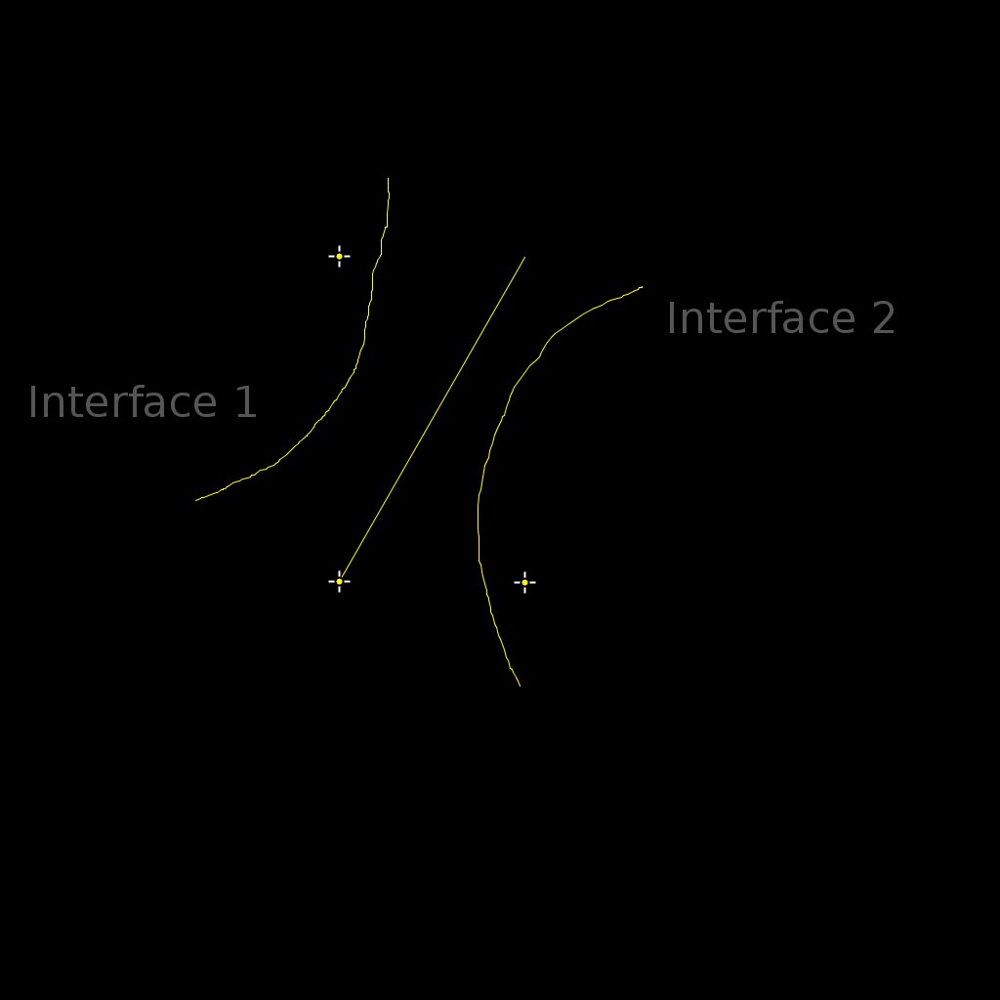
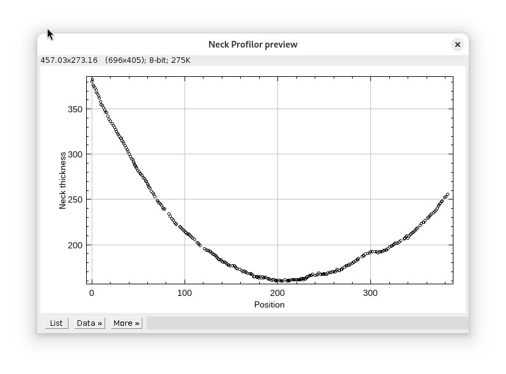

This is an ImageJ plugin that can measure the distance profile between two interfaces.

Draw the interfaces with the Freehand line ImageJ tool, and the profile is automatically measured.

This was created as a tool to measure images of biological samples, so the buttons in the interface are named as-such.

